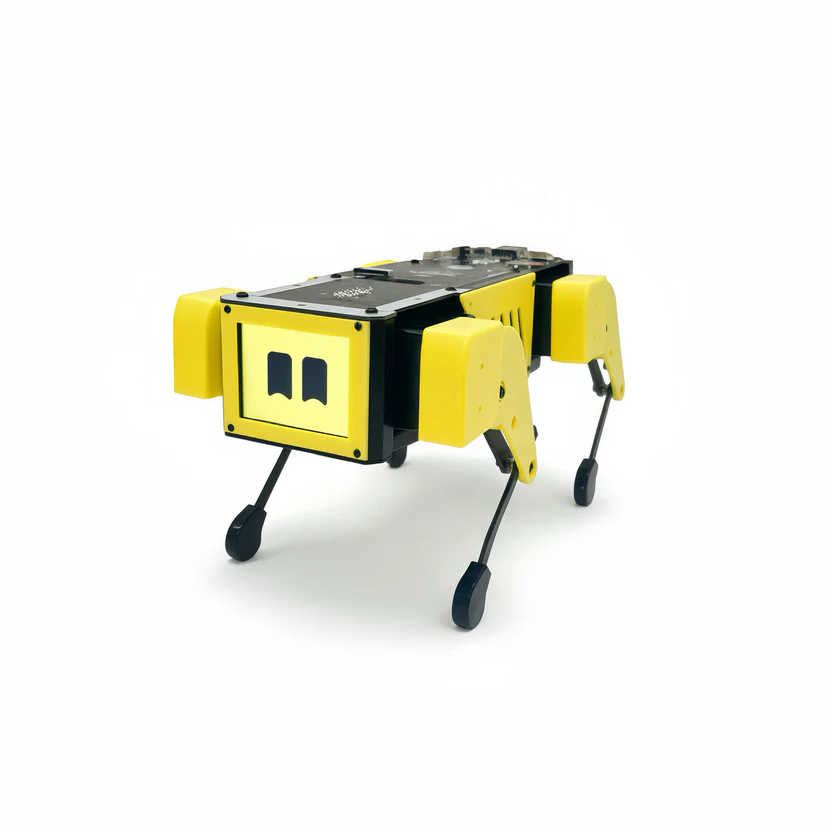
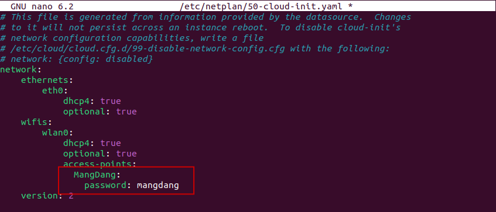
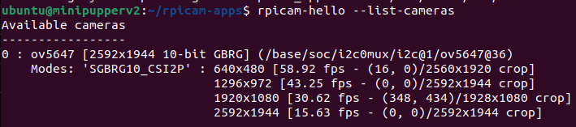

# Mini Pupper ROS2 Robotics Course
## Lab 1 — Setup, Orientation & First Bringup

---

**Objectives:**

1. Understand the Mini Pupper 2 hardware and software architecture.
2. Flash the official Ubuntu 22.04 + ROS2 Humble image to the SD card.
3. Connect the robot to WiFi and establish an SSH connection from your PC.
4. Complete the first full robot bringup and verify all hardware is operational.
5. Verify the camera is detected and can capture images.

---

**Reference Material:**

- [Mini Pupper 2 Official Docs](https://minipupperdocs.readthedocs.io/en/latest/guide/ROS2Guide.html)
- [ROS2 Humble Documentation](https://docs.ros.org/en/humble/)
- [MangDang GitHub](https://github.com/mangdangroboticsclub/mini_pupper_ros)

---

## Background

The Mini Pupper 2 is an open-source quadruped robot built around the Raspberry Pi Compute Module 4 (CM4). It runs Ubuntu 22.04 and ROS2 Humble, making it a great platform for learning robotics. For this Lab we will be using a LD06 lidar scanner which operates on a 2D plane allowing use to "see" what is around us. 
  
**Key hardware specs:**

| Component | Details |
|-----------|---------|
| Computer | Raspberry Pi Compute Module 4 (CM4) |
| OS | Ubuntu 22.04 LTS (aarch64) |
| Servos | 12x serial smart servos (3 per leg) with position feedback |
| IMU | Built-in 6-axis inertial measurement unit |
| Lidar | LD06 — 360° laser scanner, 12m range |
| Camera | Raspberry Pi Camera Module (CSI connector) |
| Extra MCU | ESP32 for low-level hardware control |

The Mini Pupper v2 differs from v1 in several important ways. Instead of straight up using a Raspberry Pi 4B it uses a Computer Module 4 or CM4 instead, letting us have a smaller footprint while still using the same processor. This version also has a built-in IMU and ESP32 to allow for more programability and fun projects. These changes affect how we write ROS2 code to control it.

---

## Lab Tasks

### 1.1 Flash the SD Card

**Grading rubric:** Correct image used, successful first boot, screenshot of boot.

Download the official Mini Pupper 2 image:

```
2024Oct.12.Ubuntu22.04.MiniPupper2.ROS2Humble.zip
```

from the [MangDang Google Drive](https://drive.google.com/drive/folders/1_HNbIb2RDmHpwECjqiVlkylvU19BSfOh).

Extract the zip to get the `.img` file. Flash it to your SD card using [balenaEtcher](https://etcher.balena.io/). Insert the SD card into the Mini Pupper 2 carrier board and power on the robot.

!!! warning
    Make sure you select the correct drive in balenaEtcher. Flashing will erase all data on the target drive.

---

### 1.2 — WiFi, SSH, camera Setup

Once booted, screen will say "IP: no IPv4 address" to fix this there is two options. Change your phone name to "MangDang" and set your Personal Hotspot password as "mangdang" to match the Puppers . Another option is to connect the micro-HDMI cable to the display port on the Mini Pupper and log into ubuntu.  
Username: ubuntu  
Password: mangdang  
After successfully logging in you can now edit the network configuration file.
```bash
sudo nano /etc/netplan/50-cloud-init.yaml
```
Edit "MangDang" to your WI-FI SSD and change the password to your wifi password 


 connect the robot to your WiFi network. Find the robot's IP address (shown on screen of pupper) and SSH in from your PC:

```bash
ssh ubuntu@<Pupper_IP>
# password: mangdang
```

Fix the ROS2 GPG key (required on ubuntu to avoid apt errors):

```bash
sudo curl -sSL https://raw.githubusercontent.com/ros/rosdistro/master/ros.key \
  -o /usr/share/keyrings/ros-archive-keyring.gpg
sudo apt update
```

Enable camera auto-detection. To do this uncomment "camera_auto_detect=1" then ctrl+s, ctrl+x

```bash
sudo nano /boot/firmware/config.txt
sudo reboot
```
These parts will take the longest.  
Install needed camera dependencies
```bash
sudo apt install -y git python3-pip ninja-build pkg-config \
  libyaml-dev python3-yaml python3-ply python3-jinja2 \
  libgnutls28-dev openssl libtiff-dev \
  qtbase5-dev libqt5core5a libqt5gui5 libqt5widgets5 \
  libboost-dev libglib2.0-dev libgstreamer1.0-dev \
  libgstreamer-plugins-base1.0-dev libevent-dev
sudo pip3 install meson --upgrade
```
create git clone and build the system 
```bash
cd ~
git clone https://github.com/raspberrypi/libcamera.git
cd libcamera
meson setup build \
  --buildtype=release \
  -Dpipelines=rpi/vc4,rpi/pisp \
  -Dipas=rpi/vc4,rpi/pisp \
  -Dv4l2=true \
  -Dgstreamer=enabled \
  -Dtest=false \
  -Dlc-compliance=disabled \
  -Dcam=disabled \
  -Dqcam=disabled \
  -Ddocumentation=disabled \
  -Dpycamera=disabled
ninja -C build -j1
sudo ninja -C build install
sudo ldconfig
```

Build rpicam-apps
```bash
cd ~
git clone https://github.com/raspberrypi/rpicam-apps.git
cd rpicam-apps
meson setup build \
  --buildtype=release \
  -Denable_libav=disabled \
  -Denable_drm=disabled \
  -Denable_egl=disabled \
  -Denable_qt=disabled \
  -Denable_opencv=disabled \
  -Denable_tflite=disabled \
  -Denable_hailo=disabled
ninja -C build -j2
sudo ninja -C build install
sudo ldconfig
```

After a complete and successful install run the command below 
```bash
rpicam-hello --list-cameras
```
and verify the camera is listed below
  


---

### 2.1 — First Robot Bringup 

Bringup is used to start all of the hardware drivers and controllers so that ROS2 can talk to the robot's hardware i.e, lidar, IMU, ect...  
SSH into the robot and view the ROS2 topics list
```bash
ros2 topic list
```
take note of these topics to compare with the next list  

SSH into the robot and launch the full bringup:

```bash
source /opt/ros/humble/setup.bash
source ~/ros2_ws/install/setup.bash #tells your terminal where to find the ROS2 packages
ros2 launch mini_pupper_bringup bringup.launch.py
```

Open a second SSH session and take a look at the new list of topics:

```bash
source /opt/ros/humble/setup.bash
source ~/ros2_ws/install/setup.bash
ros2 topic list
```

You will see multiple new topics added to the list. 

---

### 3.1 — Camera Verification

Verify the camera is detected by libcamera:

```bash
rpicam-hello --list-cameras
```

Expected output:
```
Available cameras
-----------------
0 : ov5647 [2592x1944 10-bit GBRG] (...)
```

Capture a still image:

```bash
rpicam-still -o ~/test.jpg --immediate
```

Copy the image to your PC and verify it is viewable:

```bash
# Run on your PC
scp ubuntu@<ROBOT_IP>:~/test.jpg ~/Desktop/test.jpg
```

---

### Tasks
1. Flash SD card and take picture of the robot's screen showing a successful boot prompt of "IP: no IPv4 address".

2. Take picture of the robot's screen showing a successful boot prompt the new IP shown on the screen

3. Bringup launches without errors, make note and list the different topics listed after bringup is running vs before it was ran, screenshot provided.

4. Submit the captured `test.jpg` image.


## Troubleshooting

??? question "ros2 topic list shows nothing or command not found"
    You need to source ROS2 first:
    ```bash
    source /opt/ros/humble/setup.bash
    source ~/ros2_ws/install/setup.bash
    ```
??? question "apt update shows GPG signature errors"
    Re-run the GPG key fix from Task 2.

??? question "rpicam-hello shows no cameras"
    Confirm `camera_auto_detect=1` is uncommented in `/boot/firmware/config.txt` and that you rebooted after making the change. Also check the ribbon cable is fully seated in the CSI connector.

??? question "Lidar not showing in topic list"
    Verify the lidar is connected to the correct serial port:
    ```bash
    ls /dev/ttyAMA*
    ```
??? question "Robot appears unlevel" 
    If you notice the robot does not appear level or "calibrated" please exit bringup by using ctrl+c and then run 
    ```bash
    calibrate
    ```
    to preform a calibration and fix unlevel legs. Please gently remove the rubber feet pads before calibration by pulling them off"


---
