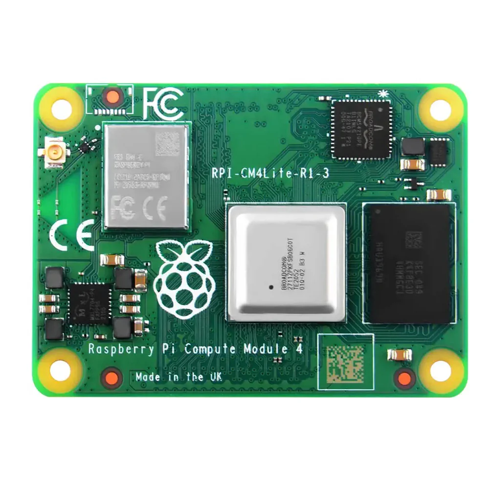
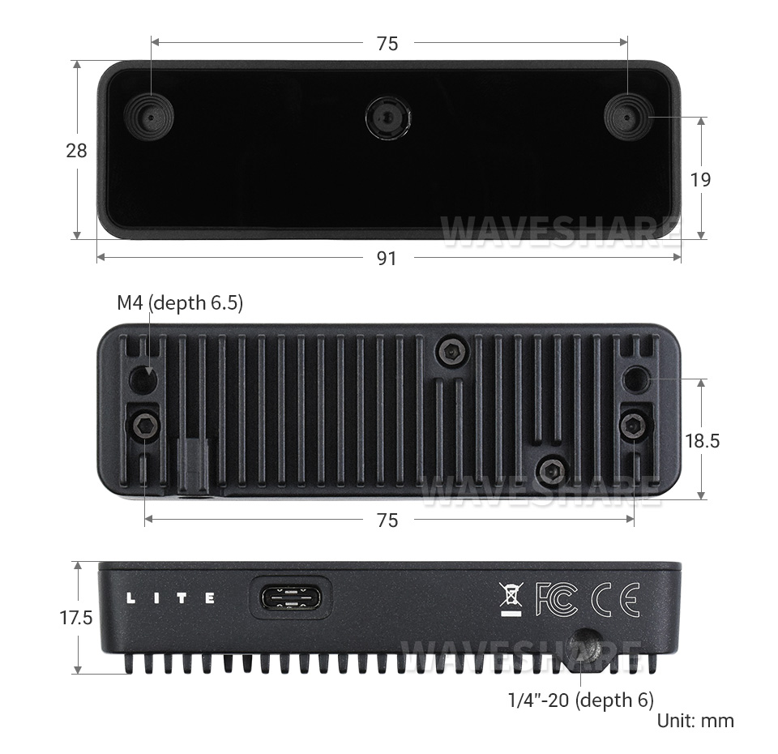

# Mini Pupper ROS2 Robotics Course
## Lab 1 — Setup, Orientation & First Bringup

---

**Objectives:**

1. Understand the Mini Pupper 2 hardware and software architecture.
2. Flash the official Ubuntu 22.04 + ROS2 Humble image to the SD card.
3. Connect the robot to WiFi and establish an SSH connection from your PC.
4. Complete the first full robot bringup and verify all hardware is operational.
5. Verify the camera is detected and can capture images.

---

**Reference Material:**

- [Mini Pupper 2 Official Docs](https://minipupperdocs.readthedocs.io/en/latest/guide/ROS2Guide.html)
- [ROS2 Humble Documentation](https://docs.ros.org/en/humble/)
- [MangDang GitHub](https://github.com/mangdangroboticsclub/mini_pupper_ros)
- [depthai-ros (GitHub)](https://github.com/luxonis/depthai-ros)

---

## Background

The Mini Pupper 2 is an open-source quadruped robot. It runs Ubuntu 22.04 and ROS2 Humble, making it a great platform for learning robotics.

{width=450}
  
**Key hardware specs:**

| Component | Details |
|-----------|---------|
| Computer | Raspberry Pi Compute Module 4 (CM4) |
| OS | Ubuntu 22.04 (aarch64) |
| Servos | 12x serial smart servos (3 per leg) with position feedback |
| IMU | Built-in 6-axis inertial measurement unit |
| Lidar | STL-06P — 360° laser scanner, 12m range, ~4,500 samples a sec |
| Camera | OAK-D Lite (USB3, DepthAI) |
| Extra MCU | ESP32 for low-level hardware control |

The Mini Pupper v2 differs from v1 in several important ways. Instead of using a Raspberry Pi 4B it uses a Computer Module 4 or CM4 instead, letting us have a smaller footprint while still using the same processor.
{width=450}

This version also has a built-in IMU and ESP32-S3 to allow for more programability and fun projects.

---

## Lab Tasks

### 1.1 Flash the SD Card

Download the official Mini Pupper 2 image:

```
2024Oct.12.Ubuntu22.04.MiniPupper2.ROS2Humble.zip
```

from the [MangDang Google Drive](https://drive.google.com/drive/folders/1_HNbIb2RDmHpwECjqiVlkylvU19BSfOh).

Extract the zip to get the `.img` file. Flash it to your SD card using [balenaEtcher](https://etcher.balena.io/). Insert the SD card into the Mini Pupper 2 carrier board and power on the robot.

!!! warning
    Make sure you select the correct drive in balenaEtcher. Flashing will erase all data on the target drive.

---

### 1.2 — WiFi & SSH Setup

Once booted, screen will say "IP: no IPv4 address" to fix this there is two options. Change your phone name to "MangDang" and set your Personal Hotspot password as "mangdang" to match the Puppers . Another option is to connect the micro-HDMI cable to the display port on the Mini Pupper and log into ubuntu.  
Username: ubuntu  
Password: mangdang  
After successfully logging in you can now edit the network configuration file.
```bash
sudo nano /etc/netplan/50-cloud-init.yaml
```
Edit "MangDang" to your WI-FI SSD and change the password to your wifi password 
{width=700}

 connect the robot to your WiFi network. Find the robot's IP address (shown on screen of pupper) and SSH in from your PC:

```bash
ssh ubuntu@<Pupper_IP>
# password: mangdang
```

Fix the ROS2 GPG key (required on ubuntu to avoid apt errors):

```bash
sudo curl -sSL https://raw.githubusercontent.com/ros/rosdistro/master/ros.key \
  -o /usr/share/keyrings/ros-archive-keyring.gpg
sudo apt update
```

Set your ROS Domain ID

```bash
echo 'export ROS_DOMAIN_ID=42' >> ~/.bashrc
source ~/.bashrc
```
**Task 1:** Take a picture of the robot showing its IP address on the screen. 
---

### 2.0 — Board Support Package (BSP) Install

The BSP installs the low-level services the robot needs to function, including the ESP32 proxy that talks to the servos, the battery monitor, and the `calibrate` command used to level the robot's legs.

SSH into the robot and run:

```bash
cd mini_pupper_bsp
```

Run the install:

```bash
./install.sh
sudo reboot
```

---

### 2.1 — First Robot Bringup 

Bringup is used to start all of the hardware drivers and controllers so that ROS2 can talk to the robot's hardware i.e, lidar, IMU, ect...  
SSH into the robot and view the ROS2 topics list.
```bash
ros2 topic list
```
Take note of these topics or keep that terminal open to compare with the next list.

SSH into the robot and launch the full robot bringup:

```bash
source /opt/ros/humble/setup.bash
source ~/ros2_ws/install/setup.bash
ros2 launch mini_pupper_bringup bringup.launch.py
```

!!! note
    `~/ros2_ws` is the main ROS2 workspace on the robot. It contains all the Mini Pupper packages and was pre-built on the flashed image. Sourcing `install/setup.bash` tells your terminal where to find those packages — without it, ROS2 won't know the Mini Pupper launch files exist.

Open a second SSH session and take a look at the new list of topics:

```bash
source /opt/ros/humble/setup.bash
source ~/ros2_ws/install/setup.bash
ros2 topic list
```

You will see multiple new topics added to the list.

**Task 2:** Compare and list the different topics that are listed before and after bringup was launched. What do you think these new topics are doing?

---

### 3.1 — OAK-D Lite Camera Setup & Verification

{width=350}

Plug the OAK-D Lite into one of the CM4's USB ports using the USB-C to USB-A (or USB-C to USB-C) cable that came with it. It's USB3-capable but works fine on USB2 too, just at lower bandwidth.

SSH into the robot and confirm the OS sees it:

```bash
lsusb | grep -i movidius
```

You should see something like `03e7:2485` (unbooted) or `03e7:f63b` (booted). If nothing shows up, try a different cable before going further.

DepthAI devices need udev rules to be accessible without root:

```bash
echo 'SUBSYSTEM=="usb", ATTRS{idVendor}=="03e7", MODE="0666"' | sudo tee /etc/udev/rules.d/80-movidius.rules
sudo udevadm control --reload-rules && sudo udevadm trigger
sudo usermod -aG plugdev $USER
```

Install the DepthAI Python library.

```bash
python3 -m pip install --upgrade pip
python3 -m pip install depthai
python3 -c "import depthai as dai; print(dai.Device.getAllAvailableDevices())"
```

This should list your OAK-D Lite with its MX ID.

Install the ROS2 wrapper:

```bash
sudo apt update
sudo apt install ros-humble-depthai-ros
```

SSH into the robot and launch the full bringup:

```bash
source /opt/ros/humble/setup.bash
source ~/ros2_ws/install/setup.bash 
ros2 launch mini_pupper_bringup bringup.launch.py
```

!!! note
    If you run bringup and it comes with any errors such as "[servo_interface-6] [Errno 2] No such file or directory" please run: 
    ```bash
    cd ~/mini_pupper_bsp/esp32_proxy
    sudo ./install.sh
    sudo systemctl restart esp32-proxy
    sudo systemctl status esp32-proxy
    ```

Launch the camera node:

```bash
source ~/ros2_ws/install/setup.bash
ros2 launch depthai_ros_driver camera.launch.py
```

In a separate SSH session (or from your PC), verify the topic is publishing:

```bash
ros2 topic list | grep camera
ros2 topic hz /camera/image_raw
```

View the live feed to confirm the image itself looks correct. It may just be a single frame but as long as you get an image that is fine. 

```bash
# Run on your PC
ros2 run image_view image_view --ros-args --remap image:=/oak/rgb/image_raw
```

Select `/camera/image_raw` from the topic dropdown and confirm you see a live image.

!!! warning
    If you're checking topics from your PC rather than directly on the robot, remember that `topic list` confirming a topic exists is discovery only — it doesn't guarantee you're actually receiving frame data. Make sure your DDS configuration is set up the way you've got it working for your other topics.

**Task 3:** Submit a screenshot of `rqt_image_view` showing a live feed from the OAK-D Lite on `/camera/image_raw`.

---

### Tasks

1. Take picture of the robot's screen showing a successful boot prompt the new IP shown on the screen

2. Compare and list the different topics that are listed before and after bringup was launched. What do you think these new topics are doing?

3. Submit a screenshot of `rqt_image_view` showing a live feed from the OAK-D Lite on `/camera/image_raw`.


## Troubleshooting

??? question "ros2 topic list shows nothing or command not found"
    You need to source ROS2 first:
    ```bash
    source /opt/ros/humble/setup.bash
    source ~/ros2_ws/install/setup.bash
    ```
??? question "lsusb doesn't show the Movidius device"
    Try a different USB port or cable — loose USB-C connections are the most common culprit. If you just plugged it in, give it a few seconds and re-run `lsusb`.
??? question "Robot appears unlevel" 
    If you notice the robot does not appear level or calibrated please exit bringup by using ctrl+c and then run 
    ```bash
    calibrate
    ```
    to preform a calibration and fix unlevel legs. Please gently remove the rubber feet pads before calibration by pulling them off"


---
