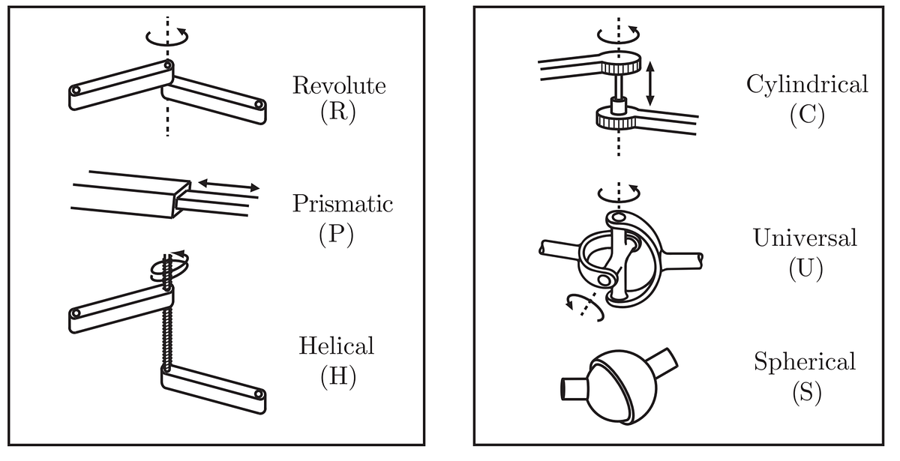
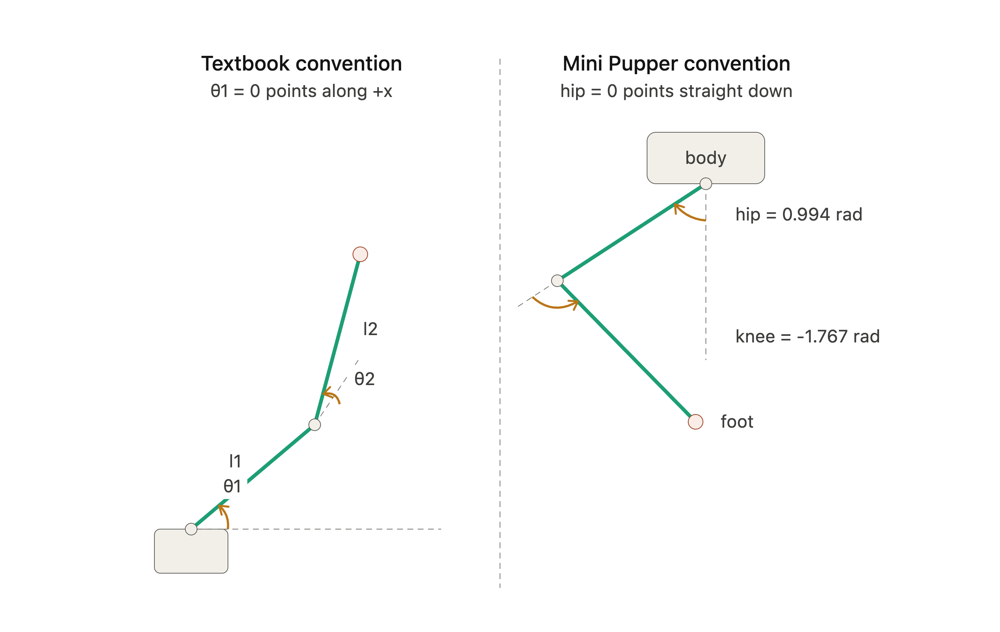

# Week 4 — Forward & Inverse Kinematics

---

**Objectives:**

1. Explain the difference between forward kinematics (FK) and inverse kinematics (IK).
2. Compute a Mini Pupper 2 foot position from real hip and knee joint angles.
3. Compute the joint angles needed to reach a target foot position (IK).
4. Identify why the real robot's joint-angle convention differs from a textbook 2-link arm, and adjust for it.
5. Cross-check hand-derived kinematics against the real robot's `/joint_states` and TF data.

---

**Reference Material:**

- [Mini Pupper 2 URDF — leg geometry source](https://github.com/mangdangroboticsclub/mini_pupper_ros/blob/ros2-dev/mini_pupper_description/urdf/mini_pupper_2/mini_pupper_description.urdf.xacro)
- Week 3 Lab — Teleop, RViz2 & TF Tree (you'll reuse `tf2_echo` here)

---

## Background

This week you'll learn the two core problems every legged robot's controller has to solve, and solve them yourself, by hand, for one leg of the Mini Pupper 2.

Picture one leg simplified to two rigid links connected by two joints. A hip and a knee, both rotating in the same plane. This is an RR model (R standing for revolute) .

- **Forward kinematics (FK):** given the joint angles, where is the foot? Straightforward trig, one unique answer.
- **Inverse kinematics (IK):** given a *target* foot position, what joint angles get it there? Harder — there can be zero, one, or two valid answers, and sometimes the target is simply out of reach.

Here is a short [video](https://www.youtube.com/shorts/wCPYtaVuW2w) giving an explanation of the difference. Although it is animation related in the video I still think it was a great explanation.

CHAMP solves IK continuously, many times a second, for all four legs, every time you send a `/cmd_vel` command. Now we get to do that by hand.

We're using real measurements from the Mini Pupper 2's URDF, front-right leg:

| Quantity | Value |
|---|---|
| l1 — hip joint → knee joint | 5.02 cm |
| l2 — knee joint → foot contact | 5.6 cm |
| Standing pose: hip angle | 0.994 rad |
| Standing pose: knee angle | −1.767 rad |

If you've seen a 2-link RR arm before, it's almost always drawn with joint 1's zero angle pointing along pos x axis (horizontal).  The Mini Pupper 2's hip doesn't work that way, it's a hanging leg, not a horizontal arm. When the hip angle is 0, the upper leg points straight down, not forward. Plug real `/joint_states` values into the textbook formula and you'll get a wrong answer. You'll fix this yourself in Step 2.

---
 
## Forward Kinematics
 
Everything else in this lab will be Python. Create a file that you'll keep adding to throughout the lab:
 
```bash
nano ~/ros2_ws/src/mini_pupper_labs/mini_pupper_labs/fk_ik_explore.py
```
Run it anytime with:
 
```bash
python3 ~/ros2_ws/src/mini_pupper_labs/mini_pupper_labs/fk_ik_explore.py
```
 
### Step 1 — Run the Textbook Formula and Watch What Happens
 
The standard 2-link planar FK formula looks like this:
 
```python
def forward_kinematics(hip, knee, l1, l2):
    x = l1 * math.cos(hip) + l2 * math.cos(hip + knee)
    z = l1 * math.sin(hip) + l2 * math.sin(hip + knee)
    return x, z
x, z = forward_kinematics(hip, knee, l1, l2)
print(f'x={x}, z={z}')

```
 
Run it with the real standing pose — `hip=0.994`, `knee=-1.767`, `l1=0.0502`, `l2=0.056`. Defining the function isn't enough on its own — Python won't run anything inside it until something actually calls it, so add a call and a print at the bottom of your script:
 
**Task 1:** What `(x, z)` does this give you? Does that look like a leg bent at the knee, supporting weight underneath the robot's body? Why or why not?
 

```python
import matplotlib
matplotlib.use('Agg')  # headless-safe, no display needed even over SSH
import matplotlib.pyplot as plt
 
def plot_leg(foot, knee=None, filename='leg_plot.png'):
    xs, zs, labels = [0], [0], ['hip']
    if knee is not None:
        xs.append(knee[0]); zs.append(knee[1]); labels.append('knee')
    xs.append(foot[0]); zs.append(foot[1]); labels.append('foot')
 
    reach = (l1 + l2) * 1.2  # a bit more than max leg reach, so nothing gets clipped
 
    plt.figure(figsize=(5, 5))
    plt.plot(xs, zs, 'o-', linewidth=2, markersize=10)
    for x, z, label in zip(xs, zs, labels):
        plt.annotate(label, (x, z), textcoords='offset points', xytext=(8, 8), fontsize=10)
    plt.xlim(-reach, reach)
    plt.ylim(-reach, reach)
    plt.xlabel('x (m), forward')
    plt.ylabel('z (m), up')
    plt.gca().set_aspect('equal')
    plt.grid(True)
    plt.savefig(filename)
    print(f'Saved {filename}')
```
 
```python
x, z = forward_kinematics(hip, knee, l1, l2)
plot_leg((x, z), filename='step1.png')
```
 
Pull the saved image up and look at where the dot lands relative to the hip at the origin.
 
### Step 2 — Derive the Corrected Formula
 
At hip angle 0, the upper leg points straight down (−Z), not along +X. Think of the upper leg as a vector of length `l1` starting at the hip, currently pointing straight down. As the hip angle increases, the leg rotates away from straight-down.

If you rotated the vector `(0, -1)` by angle `hip` using a standard 2D rotation, you'd get:
 
```
knee_x = l1 * ( ? )
knee_z = l1 * ( ? )
```
  
**Task 2:** Fill in the two blanks. Hint: apply a standard rotation matrix to `(0, -1)` by angle `hip`. You should end up with one term using `sin(hip)` and one using `cos(hip)`, each with a sign.
 
The knee joint works the same way relative to the upper leg — when `knee=0`, the lower leg is collinear with the upper leg. So the lower leg's absolute angle relative to straight-down is `hip + knee`.
 
**Task 3:** Using the same pattern, write the full corrected FK function:
 
```python
def forward_kinematics(hip, knee, l1, l2):
    knee_x = l1 * #Code here
    knee_z = l1 * #Code here
 
    foot_x = knee_x + l2 * #Code here
    foot_z = knee_z + l2 * #Code here
 
    return foot_x, foot_z
```
 
Check your work: plugging in the standing pose should give approximately `foot_x ≈ -0.003 m`, `foot_z ≈ -0.068 m`. If you're off by more than a millimeter or two, check your signs and walk back through the derivation rather than guessing at sign flips.
 
Now that you have `knee_x`/`knee_z` along the way to the foot, plot the full bent shape using the same `plot_leg` helper from Step 1:
 
```python
knee_x = l1 * -math.sin(hip)
knee_z = l1 * -math.cos(hip)
foot_x, foot_z = forward_kinematics(hip, knee, l1, l2)
plot_leg((foot_x, foot_z), knee=(knee_x, knee_z), filename='step2.png')
```
 
Compare this against the single floating dot from Step 1.

**Task 4:** The foot ends up almost directly below the hip. Does that make sense for a standing robot? What would you expect `foot_x` to look like instead if this leg were mid-stride, swung forward?
 
---
 
## Inverse Kinematics
 
### Step 3 — Solve for Joint Angles Given a Target
 
Now solve the harder direction: given a target foot position, find the joint angles that reach it. The standard approach uses the law of cosines to solve for the knee angle first, then geometry to back out the hip angle but just like FK, the hip angle you get back has to be expressed in this robot's convention.
 
**Task 5:** Write `inverse_kinematics(target_x, target_z, l1, l2)`, returning `(hip, knee)`. The law of cosines step is the same as any 2-link IK derivation, but the final hip angle needs the same rotated reference frame from Step 2 applied in reverse.
 
Before trusting your IK, add a real reachability check: the target's distance from the hip must be ≤ `l1 + l2`, or there's no solution.
 
### Step 4 — Round-Trip Test
 
The most reliable way to check IK is correct: feed its output straight back into your corrected FK function.
 
```python
target_x, target_z = -0.003, -0.068
 
hip_solved, knee_solved = inverse_kinematics(target_x, target_z, L1, L2)
foot_x, foot_z = forward_kinematics(hip_solved, knee_solved, L1, L2)
 
print(f'Target:  ({target_x:.4f}, {target_z:.4f})')
print(f'FK(IK):  ({foot_x:.4f}, {foot_z:.4f})')
```
 
These should match to within a small floating-point tolerance.

**Task 6:** Try a target foot position farther forward (a larger x value, your choice). Does the round-trip still hold? Now try a target clearly out of reach (farther than `l1 + l2` from the hip) — what does the function do?
 
---
 
## Cross-Checking Against the Real Robot
 
### Step 5 — Compare Against `/joint_states` and TF
 
With the robot standing still (with bringup running), read the real joint values:
 
```bash
ros2 topic echo /joint_states --once
```
 
Find the front-right leg's hip and knee entries (match them up using the `name` array — `position` follows the same order). Feed these live values into your FK function.
 
Then check the real spatial relationship using TF:
 
```bash
ros2 run tf2_ros tf2_echo rf1 rffoot
```
 
**Task 7:** How close is your FK script's computed foot position to what TF actually reports? 
---
 
## Looking Ahead: Classical vs. Learned Control
 
This week's IK is the classical approach to legged locomotion. It's exactly what CHAMP does. Week 5 takes a fundamentally different path: a reinforcement-learned policy that never derives an equation at all — it learns, through trial and lots of simulated trial-and-error, what joint angles tend to produce good walking.
 
**DELIVERABLE:** Answer the following.
 
1. Your hand-derived IK gives an exact, guaranteed-correct answer for a reachable target (when one exists). What could a learned policy give up by not deriving exact equations, and what does it gain in return?

---
 
## Tasks
 
1. Textbook-formula output at the standing pose, and explanation of why it's wrong (Step 1).
2. Corrected FK derivation, filled in and verified against the expected `(-0.003, -0.068)` result (Step 2).
3. Written answers on foot-forward expectation and the hip/knee asymmetry (Step 2).
4. Working `inverse_kinematics` function with a reachability check (Step 3).
5. Round-trip test results, including the out-of-reach case (Step 4).
6. Real-robot cross-check: FK output vs. `tf2_echo rf1 rffoot`, with explanation of any gap (Step 5).
7. Classical-vs-learned discussion, 3 questions (Looking Ahead).
---
 
## Troubleshooting
 
??? question "My textbook FK gives a foot position way above the robot, or off to one side"
    That's the expected (wrong) result from Step 1 — it's not a bug, it's the point of that step. Move on to the corrected derivation in Step 2.
 
??? question "My corrected FK doesn't match the expected (-0.003, -0.068)"
    Check your signs first — it's very easy to flip a `sin`/`cos` or drop a negative sign in this derivation. Re-derive `knee_x`/`knee_z` from the rotated `(0,-1)` vector step by step rather than guessing at which sign to flip.
 
??? question "IK round-trip doesn't match the original target"
    Confirm your reachability check isn't silently passing through an unreachable target. Then check that the hip angle you return from IK is expressed in the same rotated convention your corrected FK expects — a common bug is solving IK in the textbook frame and forgetting to convert back.
 
??? question "`/joint_states` doesn't show clearly labeled hip/knee values"
    Check the `name` array in the message for entries like `rf1_rf2` and `rf2_rf3` — the `position` array follows the same order. If you're not sure which is which, cross-reference with `ros2 run tf2_tools view_frames` from Week 3.
 
??? question "tf2_echo rf1 rffoot returns nothing"
    Confirm `robot_state_publisher` is running and bringup is fully up (`ros2 node list | grep robot_state_publisher`). These are both fixed-offset frames published via `/tf_static`, not `/tf` — if `/tf_static` isn't publishing, neither frame will resolve.
 
---
